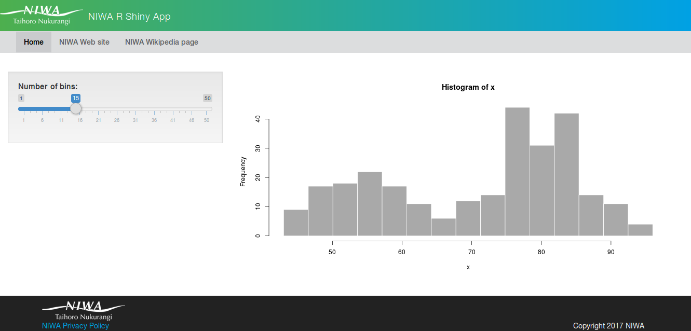

# NIWA Style guide for R Shiny Applications

NIWA has a default style guide, created in conjunction with communications team and IT systems development.

This style guide is applied to most systems within NIWA, giving a consistent image for NIWA systems.

The file `niwastyleguide.R` contains the functions used to create the top header, the menu bar, and the footer.
You can modify the links of your application by editing this file.

Here's a screen shot of the default R Shiny app with the NIWA Style Guide.

For more information, visit the [NIWA Style Guide home page](https://styles.niwa.co.nz/).
